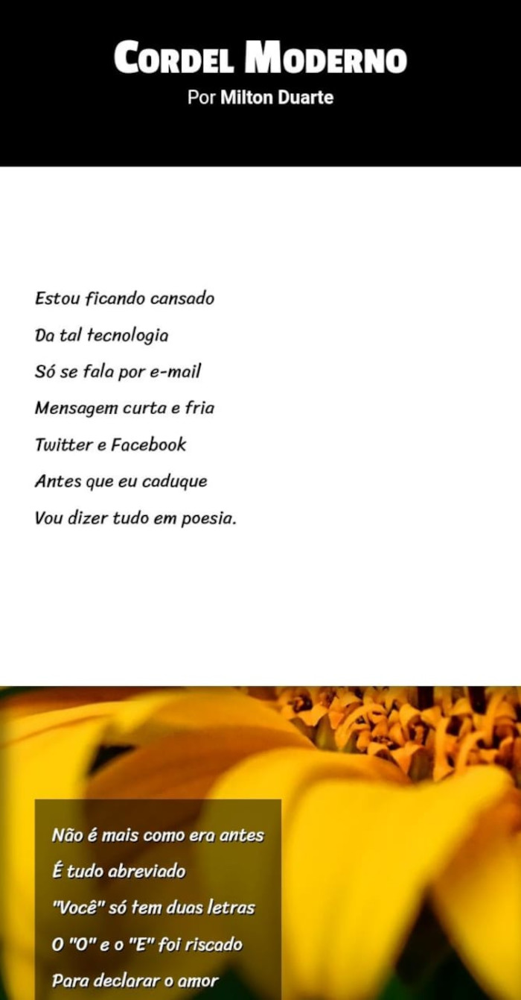

# 

<h1 align="center"> Projeto Cordel Moderno </h1>

   

O Projeto Cordel Moderno é um site com a temática de <strong>Cordel</strong>.

 

Este foi o segundo projeto proposto pelo curso de HTML & CSS, projetado por <a href="https://www.instagram.com/gustavoguanabara/">Gustavo Guanabara</a> e realizado no site do <a href="https://www.cursoemvideo.com/">CursoemVideo</a>.

 

<a href="https://willalmeid.github.io/projeto-cordel-moderno/">Acesse o projeto</a>

## 🤖 Tecnologias

Esse projeto utilizou as seguinte tecnoloogias:
 - HTML e CSS
 - Git e GitHub

## 📃 Licença

Esse projeto está sob a licença MIT.

---

Desenvolvido por <a href="https://www.linkedin.com/in/william-almeida-74ab22302/">William Almeida</a>, inspirado pelo <strong>CursoemVideo</strong>.

